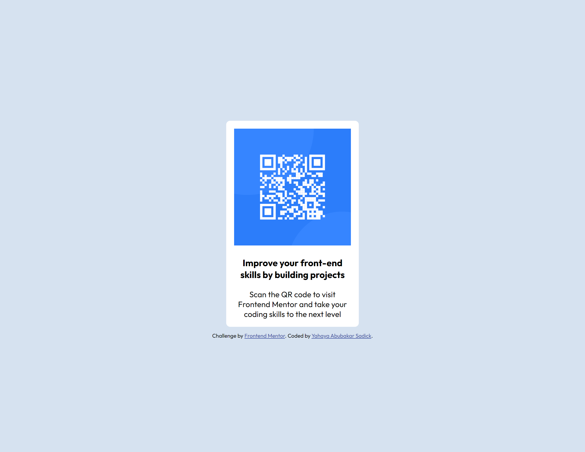

# Frontend Mentor - Intro section with dropdown navigation solution

This is a solution to the [QR code component challenge on Frontend Mentor](https://www.frontendmentor.io/challenges/advice-generator-app-QdUG-13db). Frontend Mentor challenges help you improve your coding skills by building realistic projects.

## Table of contents

- [Overview](#overview)
  - [The challenge](#the-challenge)
  - [Screenshot](#screenshot)
  - [Links](#links)
- [My process](#my-process)
  - [Built with](#built-with)
- [Author](#author)

## Overview

### The challenge

Users should be able to:

- View the optimal layout for the content depending on their device's screen size

### Screenshot

### Links

- Solution URL: [https://github.com/SadickYahaya/QR-Code-Component](https://github.com/SadickYahaya/QR-Code-Component)
- Live Site URL: [https://qr-code-component2022.netlify.app/](https://qr-code-component2022.netlify.app/)

### Built with

- HTML
- Sass
- CSS custom properties
- Flexbox
- CSS Grid

## Author

- Frontend Mentor - [@SadickYahaya](https://www.frontendmentor.io/profile/SadickYahaya)
